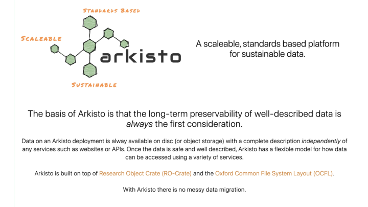

[PDF version](HASS_RDC_Technical_Advisory_Group_ATAP%20intro.pdf)

This presentation was given By Moises Sacal Bonequi, Ben Foley and Peter Sefton to the HASS RDC and Indigenous Research Capability Program
Technical Advisory Group Meeting on 2022-09-02.



<section typeof='http://purl.org/ontology/bibo/Slide'>

</section>


The Language Data Commons of Australia (LDaCA) and the Australian Text Analytics Platform (ATAP) are establishing a scalable and flexible language data and analytics commons. These projects will be part of the Humanities and Social Sciences Research Data Commons (HASS RDC).

The Data Commons will focus on preservation and discovery of distributed multi-modal language data collections under a variety of governance frameworks. This will include access control that reflects ethical constraints and intellectual property rights, including those of Aboriginal and Torres Strait Islander, migrant and Pacific communities.

This presentation builds on an [overview of the LDaCA and ATAP architecture](https://www.ldaca.edu.au/posts/rdc-tech-meeting) from 2022-02-11. This time we will zoom in on the Text Analytics side and show progress on linking active workspaces for an analysis with access-controlled data repositories, creating a [FAIR]-ready platform. Parts of this presentation are recycled from the previous one.

[fair]: https://www.nature.com/articles/sdata201618



<section typeof='http://purl.org/ontology/bibo/Slide'>

</section>

For this Research Data Commons work we are using the Arkisto Platform (introduced [at eResearch 2020](http://ptsefton.com/2020/11/23/Arkisto/index.html)).

Arkisto aims to ensure the long term preservation of data independently of code and services, recognizing the ephemeral nature of software and platforms. We know that sustaining software platforms can be hard and aim to make sure that important data assets are not locked up in database or hard-coded logic of some hard-to-maintain application.



<section typeof='http://purl.org/ontology/bibo/Slide'>

</section>

The above diagram takes a big-picture view of research data management in the context of _doing_ research. It makes a distinction between managed repository storage and the places where work is done - “workspaces”. Workspaces are where researchers collect, analyse and describe data. Examples include the most basic of research IT services, file storage, as well as analytical tools such as Jupyter notebooks (the backbone of ATAP - the text analytics platform). Other examples of workspaces include code repositories such as GitHub or GitLab (a slightly different sense of the word repository), survey tools, electronic (lab) notebooks and bespoke code written for particular research programmes. These workspaces are essential research systems but usually are not set up for long term management of data.
The cycle in the centre of this diagram shows an idealised research practice where data are collected and described and deposited into a repository frequently. Data are made findable and accessible as soon as possible and can be “re-collected” for use and re-use.

For data to be re-usable by humans and machines (such as ATAP notebook code that consumes datasets in a predictable way) it must be well described. The ATAP and LDaCA approach to this is to use the Research Object Crate (RO-Crate) specification. RO-Crate is essentially a guide to using a number of standards to describe both data and re-runnable software such as workflows or notebooks.



<section typeof='http://purl.org/ontology/bibo/Slide'>

</section>

This rather messy slide represents the overall high-level architecture for the LDaCA Research Data Commons. There will be an analytical workbench (left of the diagram) which is the basis of the Australian Text Analytics (ATAP) project. This will focus on notebook-style programming using one of the emerging Jupyter notebook platforms in that space. Our engagement lead, Dr Simon Musgrave sees the ATAP work as primarily an educational enterprise encouraging researchers to adopt new research practices, which will be underpinned by services built on the Arkisto standards, allowing for rigorous, re-runnable research.



<section typeof='http://purl.org/ontology/bibo/Slide'>

</section>

This diagram is a much simpler view zooming in on the core infrastructure components that we have built so far. We are starting with bulk ingest of existing collections and will add one-by-one deposit of individual items after that.

This shows the OCFL repository at the bottom, with a Data & Access API that mediates access. This API understands the RO-Crate format and in particular its use of the Portland Common Data Model to structure data. The API also enforces access control to objects. Every repository object has a license setting out the terms of use and re-use for its data, which will reflect the way the data were collected. Information about copyright and privacy laws, and whether participants have signed agreements and ethics approvals, are all relevant here. Each license will correspond to a group of people who have agreed to and/or been selected by a data custodian. We are in negotiations with the [Australian Access Federation (AAF)](https://aaf.edu.au/) to use their [CILogon](https://www.cilogon.org/) service for this authorization step and for authentication of users across a wide variety of services including the AAF itself, Google, Microsoft and GitHub.

There’s also an access portal which will be based on a full-text index (at this stage we’re using ElasticSearch) which is designed to help people find data they might be interested in using. This follows current conventions for browse/search interfaces which we’re familiar with from shopping sites. You can search for text and/or drill down using _facets_ (which are called aggregations in Elastic-land), for example, “which language am I in interested in” or “do I want [ ] Spoken or [ ] Written material”?



<section typeof='http://purl.org/ontology/bibo/Slide'>

</section>

This diagram shows some of the main components in the ATAP ecosystem of services.

A website (where you are reading this) will guide users to data in repository services (green, bottom left) where they can see data and tools together. Here, the user can choose code to run, which will then be instantiated by the BinderHub service (pink, bottom right) in the “workspaces”.

The website will also aid in discovery of training and events.



<section typeof='http://purl.org/ontology/bibo/Slide'>

<iframe width="701" height="701" src="https://www.youtube.com/embed/P23IcsoegbE" title="ATAP Data Demo" frameborder="0" allow="accelerometer; autoplay; clipboard-write; encrypted-media; gyroscope; picture-in-picture" allowfullscreen></iframe>
</section>

This silent screen recording shows Moises Sacal Bonequi navigating through the first two of many data collections in the [ATAP data repository], looking at discovery information that describes the collections and their context. Each of the collections are linked to Jupyter notebooks that can consume data from the notebooks. When Moises clicks on one of these, he can preview it in the data portal, and launch it into a fresh virtual computing instance via the ATAP BinderHub workspace running on the [ARDC Nectar Research Cloud].

The recording also shows a couple of Jupyter notebooks that operate on the two data collections in the repository.

1.  The [COOEE notebook](https://github.com/Australian-Text-Analytics-Platform/cooee/blob/main/cooee.ipynb), developed by Ben Foley the Applications and Training lead at ATAP, is a bare-bones demonstration of how to explore the collection, look at files etc.

2.  The [Farms to Freeways notebook](https://github.com/Australian-Text-Analytics-Platform/farms-to-freeways/blob/main/farms-to-freeways.ipynb) was developed by one of the data scientists who was working with us at UQ, Mel Mistica, along with our tech team. This notebook uses the API to get the metadata for a social history collection containing transcribed interviews with women in Western Sydney. The notebook shows how a data scientist might explore what’s in a collection, such as the age distribution of the participants, and start analysing the content in the collection.

Next steps:

- add more data, more notebooks and training material
- extend functionality of the BinderHub workshop for wider range of notebooks

[atap data repository]: https://data.atap.edu.au/
[ardc nectar research cloud]: https://ardc.edu.au/services/nectar-research-cloud/
