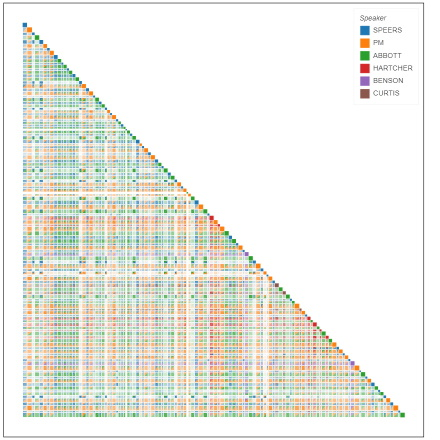
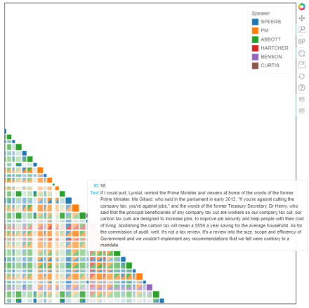

Discursis is communication analytics technology that allows a user to analyse text based communication data, such as conversations, web forums and training scenarios. It uses natural language processing (NLP) algorithms to automatically process transcribed text to highlight participant interactions around specific topics and over the time-course of the conversation. Discursis can assist practitioners in understanding the structure, information content, and inter-speaker relationships that are present within input data. Discursis also provides quantitative measures of key metrics, such as topic introduction, topic consistency, and topic novelty.

The NLP algorithms are used to construct a matrix of concept similarity scores between the sections into which a text has been divided. In the typical use case for this tool, that of a discourse with several speakers, those sections will be speaker turns and the similarity matrix provides information about the extent to which any pair of turns share concepts. This information, along with the sequential nature of the interaction, makes it possible to track topics which are maintained, or dropped, or dropped and then picked up again. It is also possible to examine the extent to which speakers are sharing concepts. These possibilities have been used in analysing various kinds of interactions, including medical consultations (see references below).

Discursis also has tools for visualising the analysis, and you can see an example of this below. The data on which these graphics are based is a debate between Kevin Rudd and Tony Abbott held at the National Press Club on 11 August 2013. Figure 1 shows a visualisation of the whole debate.


 

<h4>Figure 1. Visualisation of the whole interaction</h4>

 

Figure 2 zooms in on a section of the interaction. The boxes on the diagonal represent the speaker turns, and you can see in Figure 2 that hovering the cursor over a box causes the text of that turn to be visible.

 

<h4>Figure 2. Closer look at one part of the interaction</h4>

 


The boxes back in the matrix represent the conceptual similarity between each pair of turns. A heavily populated column means that the topics in a turn were also in many following turns and a heavily populated row means that a turn shared topics with many preceding turns. Selecting a point of intersection in the matrix displays a similarity score for the turns, and the text of both turns is displayed below the main graphic (not shown here).

[Discursis](https://itee.uq.edu.au/project/discursis) was developed by [Dan Angus](https://www.qut.edu.au/about/our-people/academic-profiles/daniel.angus), [Janet Wiles](https://itee.uq.edu.au/profile/2444/janet-wiles) and Andrew Smith and has been reworked as an open source tool by staff of [Sydney Informatics Hub](https://www.sydney.edu.au/research/facilities/sydney-informatics-hub.html). A version of the tool running in a Jupyter notebook is available in this [Github repository](https://github.com/Australian-Text-Analytics-Platform/discursis).

#### References



Angus, D., Smith, A. E., & Wiles, J. (2012). Human Communication as Coupled Time Series: Quantifying Multi-Participant Recurrence. <i>IEEE Transactions on Audio, Speech, and Language Processing</i>, 20(6), 1795–1807. <a href="https://doi.org/10.1109/TASL.2012.2189566" target="_blank">https://doi.org/10.1109/TASL.2012.2189566</a>.

Angus, D., & Wiles, J. (2018). Social semantic networks: Measuring topic management in discourse using a pyramid of conceptual recurrence metrics. <i>Chaos: An Interdisciplinary Journal of Nonlinear Science</i>, 28(8), 085723. <a href="https://doi.org/10.1063/1.5024809" target="_blank">https://doi.org/10.1063/1.5024809</a>.


### Acknowledgments

This Jupyter notebook and relevant python scripts were developed by the Sydney Informatics Hub (SIH) in collaboration with the Sydney Corpus Lab under the [Australian Text Analytics Platform program](https://doi.org/10.47486/PL074) and the [HASS Research Data Commons and Indigenous Research Capability Program](https://doi.org/10.47486/HIR001). These projects received investment from the Australian Research Data Commons ([ARDC](https://www.ardc.edu.au)), which is funded by the National Collaborative Research Infrastructure Strategy ([NCRIS](https://www.education.gov.au/ncris)).

### How to cite the notebook:

If you are using this notebook in your research, please include the following statement or an appropriate variation thereof:

_This study has utilised a notebook/notebooks developed for the Australian Text Analytics Platform (https://www.atap.edu.au) available at (https://github.com/Australian-Text-Analytics-Platform/discursis)._

In addition, please inform ATAP (info@atap.edu.au) of publications and grant applications deriving from the use of any ATAP notebooks in order to support continued funding and development of the platform.

<raw>

Copyright (c) 2022-3, The Australian Text Analytics Platform.

</raw>
