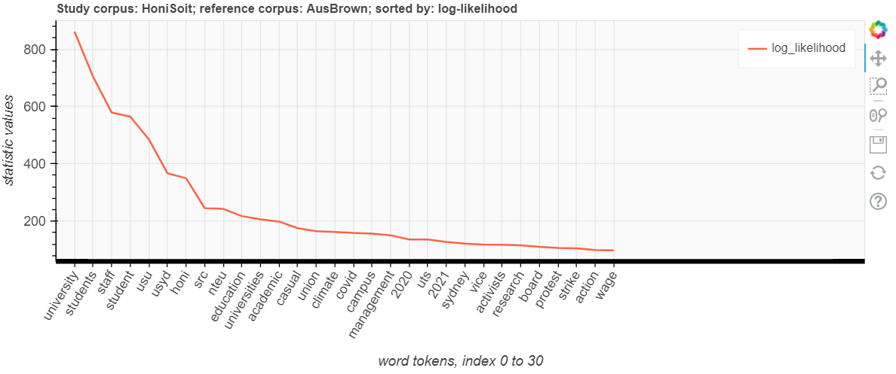
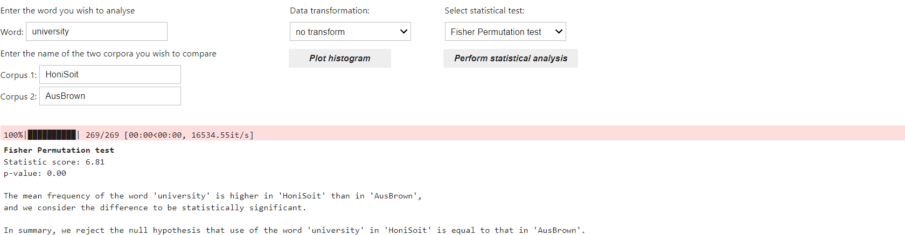

The Keyword Analysis tool is a Jupyter notebook containing code that was developed by the [Sydney Informatics Hub](https://www.sydney.edu.au/research/facilities/sydney-informatics-hub.html) (SIH) in collaboration with the [Sydney Corpus Lab](https://sydneycorpuslab.com/) as part of the [Australian Text Analytics Platform](https://www.atap.edu.au) (ATAP) project. The tool is designed to analyse words in two (or more) corpora and identify whether certain words are over- or under-represented in the ‘node’ or ‘study’ corpus (i.e., the corpus of interest) compared to a ‘reference’ corpus (i.e., the standard of comparison). It uses the keywords analysis technique pioneered by Mike Scott (Scott 1997).

The tool allows you to upload texts as individual files or as corpora/datasets (e.g., in zipped files). You can also upload frequency lists. Once your files have been uploaded, you can use the tool to calculate the statistics for the words in your corpus/corpora. The statistical calculations used in the notebook (Log Likelihood, %Diff, Bayes Factor, Effect Size for Log Likelihood, Relative Risk, Log Ratio, Odds Ratio) are the python implementation of statistical formulae provided on Paul Rayson’s [website](https://ucrel.lancs.ac.uk/llwizard.html) (used with permission), and are explained there with relevant attribution and links.

You can conduct keyword statistics between pairs of datasets (i.e., node corpus vs. reference corpus). If you have uploaded more than two corpora (e.g., corpus 1, corpus 2 and corpus 3), you can choose to compare one corpus to another (e.g., using corpus 1 as node corpus and comparing it to corpus 2 as the reference corpus), or one corpus with the rest of the data (e.g., using corpus 2 as the node corpus and comparing it to the reference corpus which is comprised of corpus 1 and 3). You can then visualise the statistics from the keyword analysis as a line graph (an example is shown in Figure 1 below).


 

<h4>Table 1. Top 30 positive keywords (x-axis) with the highest log-likelihood values (y-axis) </h4>

 


Using default settings, the resulting line (e.g., Figure 1) will show 30 positive keywords (i.e., those that occur more frequently in the node/study corpus) with the highest log-likelihood. You can produce different line graphs by selecting one or more statistics to display (log-likelihood, percent-difference, Bayesian information criterion, etc.), choosing how to sort the keywords (alphabetically or according to a selected statistical value), choosing which type of keywords to display (i.e., positive, negative, or all keywords), and adjusting the number of displayed keywords. You can save and download the visualisation to your computer using the 'save' icon on the right-hand side of the graph (see right end of Figure 1). You also have the option to save the results of the statistical analysis of keywords into a spreadsheet and download it to your local computer.

Additionally, the tool allows you to conduct multi-corpus keyword analysis. For this multi-corpus analysis, the statistics are calculated across the whole set in one go: An adjusted/expected average is calculated for each corpus and actual/observed frequencies are then compared to this average. Details are provided in the notebook itself.

The notebook also goes beyond keyword analysis in allowing users to investigate if the use of a certain word in a corpus is statistically different to the use of that same word in a different corpus. All you need to do is enter the ‘word' (e.g., _university_ in Figure 2 below) you wish to analyse, select the two corpora you wish to compare, perform data transformation if needed (i.e., using log transformation or square root transformation), and select the statistical test you want to use (either [Welch t-test](https://docs.scipy.org/doc/scipy/reference/generated/scipy.stats.ttest_ind.html#r3566833beaa2-2) or [Fisher permutation test](https://docs.scipy.org/doc/scipy/reference/generated/scipy.stats.permutation_test.html) are available to choose).


 

<h4>Figure 2. Statistical analysis of <i>university</i> using default settings</h4>

 


The tool is available on [GitHub](https://github.com/Australian-Text-Analytics-Platform/keywords-analysis) where you can launch it on Jupyter Notebook via Binder. Since Binder uses CILogon authentication, you can access it by signing in with your institutional login credentials or Google/Microsoft/Outlook account. If you have access to software that supports Jupyter Notebooks, you can also clone the Github repo and use the notebook locally (i.e., without Internet connection) on your own computer.

If you have any questions, feedback, and/or comments about the tool, you can contact the SIH at [sih.info@sydney.edu.au](mailto:sih.info@sydney.edu.au).

### Acknowledgments

This Jupyter notebook and relevant python scripts were developed by the Sydney Informatics Hub (SIH) in collaboration with the Sydney Corpus Lab under the [Australian Text Analytics Platform program](https://doi.org/10.47486/PL074) and the [HASS and Indigenous Research Data Commons program](https://ardc.edu.au/program/hass-rdc-indigenous-research-capability/). These projects received investment from the Australian Research Data Commons ([ARDC](https://www.ardc.edu.au)), which is funded by the National Collaborative Research Infrastructure Strategy ([NCRIS](https://www.education.gov.au/ncris)).

### How to cite the notebook:

If you are using this notebook in your research, please include the following statement or an appropriate variation thereof:

_This study has utilised a notebook/notebooks developed for the Australian Text Analytics Platform (https://www.atap.edu.au) available at [https://github.com/Australian-Text-Analytics-Platform/keywords-analysis](https://github.com/Australian-Text-Analytics-Platform/keywords-analysis)._

In addition, please inform [ATAP](mailto:info@atap.edu.au) of publications and grant applications deriving from the use of any ATAP notebooks in order to support continued funding and development of the platform.

<raw>
**References** {#scott}
Scott, M. (1997). PC analysis of key words—and key words. *System*, 25(1), 1–13. ([https://doi.org/10.1016/S0346-251X(97)00011-0](https://doi.org/10.1016/S0346-251X(97)00011-0))

Copyright (c) 2022-3, The Australian Text Analytics Platform.

</raw>
