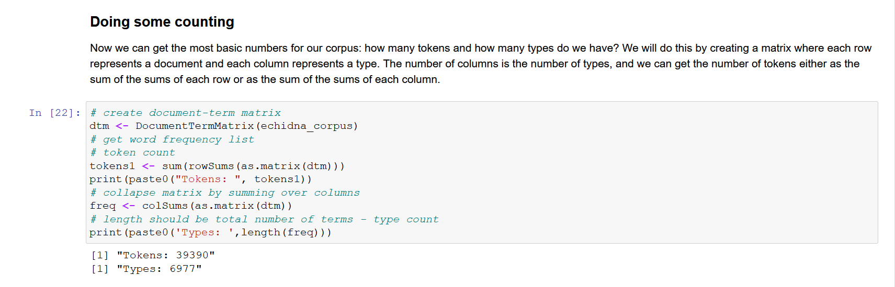

##### This work was supported by the [Sydney Informatics Hub](https://www.sydney.edu.au/research/facilities/sydney-informatics-hub.html), a Core Research Facility of the University of Sydney

One objective of the Australian Text Analytics Platform is to provide a library of code notebooks that our users – those interested in applying text analytics to research – can learn from and build upon. As the curators of such a resource, we need to learn from what’s been created before for a similar audience; and we need to understand how collections of notebooks can be used as an accessible resource for teaching, critiquing, and creating research using text analytics. These posts therefore summarise the insights we gained from a preliminary survey of key notebook resources.

This first part provides an introductory overview of the use of notebooks in text analytics and examines the pedagogically focussed genres of textbooks and tutorials. The second part looks at two other genres, tool chests and research articles, and ends with a summary and a consideration of how the discussion can inform the design of ATAP.

## What are notebooks?

Notebooks as popularised by the [Jupyter project](https://jupyter.org/) have become a key medium for experimentation and presentation in research and development. They mix code with narrative text, as well as tables, figures and interactive tools generated by the code.


 

<h4>Figure 1. A screenshot of a part of a notebook</h4>

 


Figure 1 shows part of a notebook with some text, a code cell and the results generated by running the code

A notebook can be played with interactively, allowing a user to interrogate and tweak the analysis and datasets under construction; but it can also be run as a prefabricated script that fetches a dataset, applies some processing, or generates a report. For researchers, published notebooks provide an opportunity for experimental reproducibility and reusable research pipelines.

Notebooks collected together become a library of tutorials, tools, or reproducible research publications. We found several such collections covering applied text analytics, primarily targeting humanities and social sciences (HASS) researchers, as well as some resources that mix code and narrative, but in which the code cannot be executed directly. To make full use of such resources, it is necessary to copy the code and paste it into a console or another environment where it can be run.

In addition to having a mix of content, and different approaches to teaching or guiding readers to use text analytics tools, we noted a few broad genres of notebook and types of collection, such as tutorials, tool(kits), apps and research experiments, In this post, we focus on tutorials; the following post will look at the remaining genres..
Before going on, we’d like to note that our survey is by no means complete. We’ve not had time to look in detail at the full diversity of relevant notebook collections, but hope that we have captured useful insights about the state of the art.

## Courses for different horses

While the various resources all covered core applied text analytics concepts – including acquiring data from various sources, analysing n-gram frequencies, extracting named entities, building and evaluating a topic model, and so on – notebook resources reflected different genres and hence user needs. Some sought to present a rigorous curriculum constructed of tutorials or lessons, others treat collections of notebooks as tools for the user to employ in their work, and others demonstrate the use of a notebook as a single-purpose reproducible research article.

### Courses and Textbooks

The vast majority of notebook collections we identified positioned themselves as courses, with each notebook corresponding to a tutorial. Some tutorials provide scaffolding for exercises (with or without solutions), but at a baseline, they guide readers/users through the use of a tool or concept. Frequently, the intention is for these tutorial notebooks to be walked through in a workshop, but being openly published as notebooks allows users to execute and play with them outside of the classroom.



<table>
<tr><td><b>Genre</b></td><td>Tutorial</td></tr>
<tr><td><b>Typical Structure</b></td><td><ul><li>Intro to method</li>
<li>Prepare data</li>
<li>Apply method</li>
<li>Explore parameters</li>
<li>Analyse results</li>
<li>Exercises / next steps</li></ul>

</td></tr>
<tr><td><b>Strengths</b></td><td>Addresses weak skills in methods, tooling, and/or coding ability.

A tutorial in a notebook allows the user to interject with exploratory code or exercises.</td></tr>

<tr><td><b>Weaknesses</b></td><td>A tutorial may not show its user how to build the notebook they’re viewing.

Not demonstrative of application to a research goal.</td></tr>

<tr><td><b>Example</b></td><td><a href='https://melaniewalsh.github.io/Intro-Cultural-Analytics/05-Text-Analysis/09-Topic-Modeling-Without-Mallet.html'>Topic Modeling Without Mallet</a></td></tr>
</table>

Tutorials from different authors vary in how much they surround their code with narrative and background explanations of the techniques they are applying. Sinclair and Rockwell’s [The Art of Literary Text Analysis](https://github.com/sgsinclair/alta/blob/master/ipynb/ArtOfLiteraryTextAnalysis.ipynb) (ALTA) provides extensive narrative and appears more like a textbook than a course, not intended for delivery, but for learning and reference. Melanie Walsh’s [Introduction to Cultural Analytics & Python](https://melaniewalsh.github.io/Intro-Cultural-Analytics/05-Text-Analysis/04-Sentiment-Analysis.html) explicitly presents itself as a text book constituted of notebooks, relying on the [Jupyterbook](https://jupyterbook.org/intro.html) tool to give a glossy, accessible presentation, while also supporting the user to interact with the notebooks. Not unlike ALTA, this course demonstrates a deep appreciation of the breadth of technologies available and how they might be applied – and where they might not be applicable or reliable – in digital humanities contexts. It often supports the learner by giving multiple examples of how to apply a technique, which incidentally means repeated opportunities to demonstrate data preparation with diverse inputs.

For the R programming community, Martin Schweinberger’s [LADAL](https://slcladal.github.io/) shows a thoroughness in developing users’ abilities from statistical basics to a breadth of NLP, corpus and computational linguistic methods. (As part of the ATAP project, LADAL tutorials are undergoing conversion from R markdown to Jupyter notebooks.) Technique-oriented introductory tutorials are then complemented with “focus studies” on disciplines of linguistic analysis such as learner language, stylistics or linguistic typology.
In comparison to the above sites, several other tutorial resources are much more bare, simply demonstrating how to implement a technique with little use of discussion or repeated examples.
The varying levels of narrative, and how they present the code, suggests that authors have a mix of goals that we might query:

- Is the tutorial introducing a technique, or rather its use through code?
- Is it teaching the application of a technique, or how it works?
- Does it aim to teach the reader how to read the code? How to experiment with the code? How to compose that code themselves?
- Does the notebook itself facilitate those engagements with code, or does the more ephemeral teacher?

Although not recently updated, we are indebted to Quinn Dombrowski’s curation of a [list of relevant courses and tutorials](https://github.com/quinnanya/dh-jupyter#course-materials), among other digital humanities notebooks. A recent player in this space is [TAPI (Text Analysis Pedagogy Institute)](https://labs.jstor.org/tapi/), which places open publication of notebook-based courses at the core of their researcher schooling. TAPI incorporates several courses by individual presenters, although there does not currently appear to be a high level of standardisation among the TAPI courses, including in their licensing.
[The Programming Historian](https://programminghistorian.org/) is also an excellent resource for peer-reviewed digital humanities tutorials, often helpfully grounded in use cases. Not being notebooks (nor R markdown), its tutorials can’t be directly executed, leaving the user to copy-paste its code or not engage interactively with its content. What sets the Programming Historian apart is its design as a journal of tutorials, i.e. a collaborative enterprise in text analytics pedagogy. While resources we surveyed are all essentially open to third party contributors who may offer amendments, most collections of tutorial notebooks have single or few authors and are not designed as primarily collaborative endeavours.

[Part 2](/posts/notebooks-2) of this post looks at the remaining genres we have identified, libraries and tool chests and presentations of research results. Part 2 also includes a discussion of how the information collected here might shape our view of what ATAP can be.

Note 1: Unfortunately, we confined our survey to English-language resources; and with a focus on the Notebook medium, our analysis is biassed to (but not exclusively) the Python programming language.
