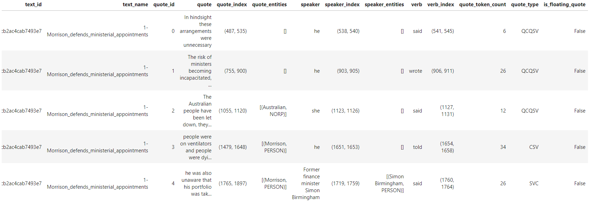
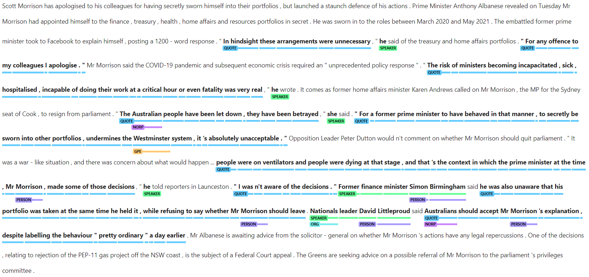
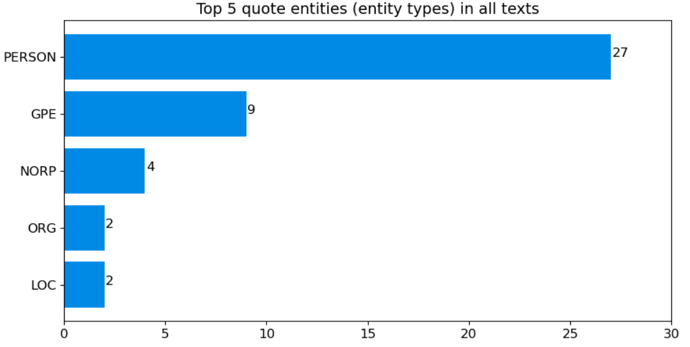

The ATAP Quotation Tool is a Jupyter notebook containing code that was adapted and developed (with permission) from the [GenderGapTracker](https://github.com/sfu-discourse-lab/GenderGapTracker) by the Sydney Informatics Hub ([SIH](https://www.sydney.edu.au/research/facilities/sydney-informatics-hub.html)) in collaboration with the [Sydney Corpus Lab](https://sydneycorpuslab.com/) as part of the Australian Text Analytics Platform ([ATAP](https://www.atap.edu.au)) project.

The quotation tool is designed to identify and extract quoted content from newspaper texts. Since the tool uses a combination of syntactic and heuristic rules to extract quotes, it is able to identify quotes whether they are marked by quoting or projecting verbs (e.g. _said_) or not.

The tool can also use [Named-Entity Recognition](https://en.wikipedia.org/wiki/Named-entity_recognition) to identify and classify the sources of these quotes and the entities within these quotes (as people, organisations, etc.). This is useful for answering a number of questions such as those related to representation of voices/sources (e.g. Who is cited the most/least? Who is not cited at all?) and those related to quoted content (e.g. What kind of information is sourced from others?).

The tool can also identify the verbs that are used to cite quotations (e.g. _say, tell, add, claim, admit_). This will be particularly useful to those interested in the variation of reporting verbs.

Once the tool has processed the files, it will display the first few identified and extracted quotes (and entities) in a table. An example of this preview table is shown in Table 1 below, which displays the identified quote along with information such as the speaker and their entity type, the entity name and type of the entities identified within the quote and the quoting/projecting verb (if there is one). The type of quote is described on the basis of the various components of the quote construction (Q = quotation mark, S = speaker, V = verb, C = content) and their linear order.


 

<h4>Table 1. Preview of first few identified and extracted quotes</h4>

 


The tool allows you to save and download the complete table of results as an Excel worksheet (.xslx format) for further analysis.

It is also possible to preview all the identified quotes and entities in individual files. In this preview (see Figure 1 below), identified quotes and entities are presented in bold face and labelled accordingly (e.g. as quote/speaker or as a specific entity type such as PERSON, NORP, GPE – see legend to Figure 2 for abbreviations). You can download the visualisation such as the one shown in Figure 1 as an html file.


 

<h4>Figure 1. Screenshot of preview showing identified entities and quotes</h4>

 


The tool also allows you to visualise the top named entities identified in the quotes and/or the top entity types among identified speakers as bar graphs – an example is shown in Figure 2.


 

<h4>Figure 2. Bar graph showing the top five entities identified within quotes across the whole corpus/dataset
 (PERSON = People, including fictional, GPE = Countries, cities, states, NORP = Nationalities or religious or political groups, ORG = Companies, agencies, institutions, etc., LOC = Non-GPE locations, mountain ranges, bodies of water)</h4>

 


You can choose to visualise the top entities for the whole corpus/dataset or individual files within the corpus/dataset. Other options for the visualisation include whether to display the entity names and/or types, and the number of top entities to display (i.e. in multiples of five). You can also choose to save the graphs (based on the set parameters) as jpg files.

The tool is available on [GitHub](https://github.com/Australian-Text-Analytics-Platform/quotation-tool) where you can launch the tool on Jupyter Notebook via Binder. That instance of Binder uses CILogon authentication, and you can access it by signing in with your (Australian) institutional login credentials or Google/Microsoft/Outlook account. If you have access to software that supports Jupyter Notebooks, you can also download the notebook to use locally (i.e. without Internet connection) on your own computer.

If you have any questions, feedback, and/or comments about the tool, you can contact the SIH at [sih.info@sydney.edu.au](mailto:sih.info@sydney.edu.au).

### Acknowledgments

This Jupyter notebook and relevant python scripts were developed by the Sydney Informatics Hub (SIH) in collaboration with the Sydney Corpus Lab under the [Australian Text Analytics Platform program](https://doi.org/10.47486/PL074) and the [HASS Research Data Commons and Indigenous Research Capability Program](https://doi.org/10.47486/HIR001). These projects received investment from the Australian Research Data Commons ([ARDC](https://www.ardc.edu.au)), which is funded by the National Collaborative Research Infrastructure Strategy ([NCRIS](https://www.education.gov.au/ncris)).

### How to cite the notebook:

If you are using this notebook in your research, please include the following statement or an appropriate variation thereof:

_This study has utilised a notebook/notebooks developed for the Australian Text Analytics Platform (https://www.atap.edu.au) available at [https://github.com/Australian-Text-Analytics-Platform/quotation-tool](https://github.com/Australian-Text-Analytics-Platform/quotation-tool)._

In addition, please inform ATAP (info@atap.edu.au) of publications and grant applications deriving from the use of any ATAP notebooks in order to support continued funding and development of the platform.

<raw>

Copyright (c) 2022-3, The Australian Text Analytics Platform.

</raw>
