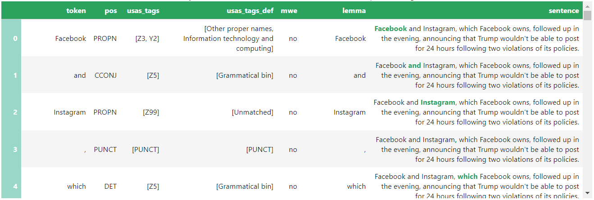
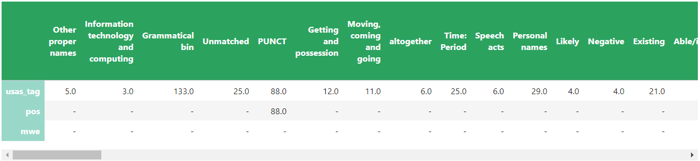
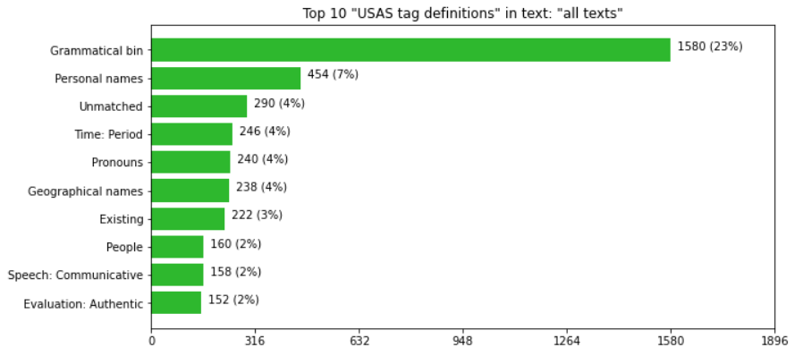
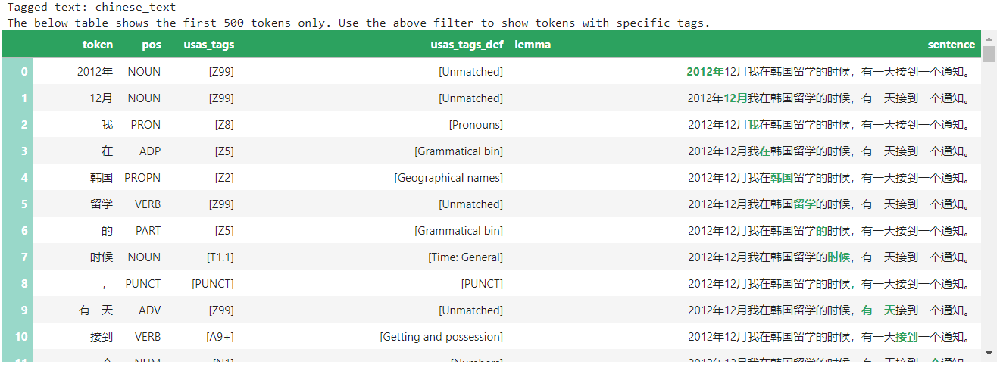

The Semantic Tagger tool is a Jupyter notebook containing code that was adapted and developed (with permission) from the Python Multilingual Ucrel Semantic Analysis System ([PyMUSAS](https://ucrel.github.io/pymusas/)) by the Sydney Informatics Hub ([SIH](https://www.sydney.edu.au/research/facilities/sydney-informatics-hub.html)) in collaboration with the [Sydney Corpus Lab](https://sydneycorpuslab.com/) as part of the Australian Text Analytics Platform ([ATAP](https://www.atap.edu.au/)) project.

The tool automatically processes text data, categorises and annotates words or multi-word expressions (MWEs, e.g. New South Wales) based on their meaning class (e.g. location/place). Currently, the tool has been designed to annotate text data using Paul Rayson’s Ucrel Semantic Analysis System ([USAS](https://ucrel.lancs.ac.uk/usas/)) semantic tagset. The automatic semantic tagging helps bypass the time-consuming task of manually coding a large amount of text data.

The tool allows you to preview the results (i.e. the first 500 tokens) for individual files in the form of a table – an example is shown in Figure 1 below. The preview table displays the tokens (i.e. words) alongside other information such as their assigned USAS tag, definition of the assigned USAS tag, and the sentence where the word occurs. You can choose to preview the results for one text file or two sets of results (i.e. for two separate files) for comparison. As shown in Figure 1, the tool also displays the lemma (the form that would be listed in a dictionary) and part-of-speech (POS) tags for each word or MWE. This aspect of the tool may be of interest to those examining the association between the part-of-speech function of a word (or MWEs) and their semantic class. The full results (i.e. table for all files) can be downloaded as a comma separated file (.csv) or as an excel spreadsheet (.xlsx) containing the tagged texts, or as a zipped folder (.zip) of tagged text (.txt) files, which can then be used to conduct further analysis.


 

<h4>Figure 1. Screenshot of the resulting table showing the first 500 tokens (only first five visible) with their corresponding POS tag, USAS tag, etc.</h4>

 


The tool also produces another table that displays the frequency for every semantic category associated with each USAS tag. In essence, this table shows the number of tokens that have been assigned each semantic category/tag as seen in Figure 2.


 

<h4>Figure 2. Screenshot of part of the table showing all of the USAS tags and how many words were assigned certain tags</h4>

 


The tool also allows you to visualise the most commonly assigned semantic categories/tags or POS tags as well as the most frequent lemmas, tokens, or MWEs as bar graphs – an example is shown in Figure 3 below. It is also possible to adjust the number of top items to display (i.e. in multiples of five). You can choose to visualise the most frequently assigned tags for the whole corpus or for individual files within the dataset. In the event you want to produce visualisations for individual files, you can choose to do this for just one file or for two separate files (e.g. for comparison). You can also choose to save all of the visualisations you produced (based on the set parameters) as jpg files.


 

<h4>Figure 3. A bar graph showing the most frequently assigned USAS tags in the entire corpus</h4>

 


In addition to English, there is a multilingual version of the Semantic Tagger tool. This version of the tool can tag (traditional or simplified) Chinese (see Figure 2 below), Italian, or Spanish texts using the corresponding USAS tagset for these languages (with differing accuracy, coverage, etc.). (For those interested in Chinese, the tool can parse unsegmented Chinese text data and assign the appropriate semantic (and POS) tags.)


 

<h4>Figure 4. Screenshot of the resulting table (from the multilingual Semantic Tagger) showing Chinese words with their corresponding POS tag, USAS tag, etc.</h4>

 


The English Semantic Tagger tool is available on [GitHub](https://github.com/Australian-Text-Analytics-Platform/semantic-tagger) while the multilingual version is available on a separate [GitHub page](https://github.com/Australian-Text-Analytics-Platform/semantic-tagger/tree/multi-lingual). You can launch both on Jupyter Notebook via Binder. Since Binder uses CILogon authentication, you can access it by signing in with your institutional login credentials or Google/Microsoft/Outlook account. If you have access to software that support Jupyter Notebooks, you can also download the notebook to use locally (i.e. without Internet connection) on your own computer.

If you have any questions, feedback, and/or comments about the tool, you can contact the SIH at [sih.info@sydney.edu.au](mailto:sih.info@sydney.edu.au).

### Acknowledgments

This Jupyter notebook and relevant python scripts were developed by the Sydney Informatics Hub (SIH) in collaboration with the Sydney Corpus Lab under the [Australian Text Analytics Platform program](https://doi.org/10.47486/PL074) and the [HASS Research Data Commons and Indigenous Research Capability Program](https://doi.org/10.47486/HIR001). These projects received investment from the Australian Research Data Commons ([ARDC](https://www.ardc.edu.au)), which is funded by the National Collaborative Research Infrastructure Strategy ([NCRIS](https://www.education.gov.au/ncris)).

The notebook incorporates code and/or methods developed by Prof Paul Rayson and his team, details of which can be found at the [PyMUSAS GitHub page](https://ucrel.github.io/pymusas/).

### How to cite the notebook:

If you are using this notebook in your research, please include the following statement or an appropriate variation thereof:

_This study has utilised a notebook/notebooks developed for the Australian Text Analytics Platform (https://www.atap.edu.au) available at [https://github.com/Australian-Text-Analytics-Platform/semantic-tagger](https://github.com/Australian-Text-Analytics-Platform/semantic-tagger)._

In addition, please inform [ATAP](mailto:info@atap.edu.au) of publications and grant applications deriving from the use of any ATAP notebooks in order to support continued funding and development of the platform.

<raw>

Copyright (c) 2022-3, The Australian Text Analytics Platform.

</raw>
