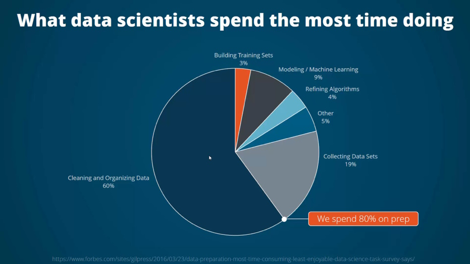

### Introducing data preparation concepts

This graphic is, sadly, all too true. Data scientists and those who are using
data as part of their research spend much of their time preparing their
dataset and transforming its structure into a format that can be used (often
referred to as [data wrangling](https://online.hbs.edu/blog/post/data-wrangling)
or data munging). The Australian Text Analytics Platform will offer a range
of tools to assist in cleaning text data and performing other preliminary
operations which can prepare the data for analysis. ATAP analysis notebooks
assume a common data structure, however the platform will provide notebooks
containing code for transforming data into the structure that is needed for
the procedure(s) in the analysis notebooks.

There are two main processes that are needed to prepare text data for analysis
, [cleaning](#common-cleaning-techniques) and [annotation](#annotation), and
the ones that you will need to use will depend on the dataset that you are
using.

### Common Cleaning Techniques

- **Making all of the text lower case:**
  This ensures that e.g. _dog_ and _Dog_ will not be treated as different items
  and is important if you are going to use analytic methods which rely on
  counting items. However, if you are planning to extract entities from your
  text data, retaining capital letters may be important.

- **Standardising spelling:**
  At least for English text, there are some well-known spelling variations,
  some with a geographical context (_colour/color_) and some that are more a
  matter of personal preference (_recognise/recognize_). As with case,
  standardising spelling ensures that pairs like the examples are treated as
  tokens of the same type.

- **Removing stopwords:**
  Stopwords are function words that are not interesting for many analyses and
  we can safely remove them from our data using a stoplist. The 20 most
  frequently occurring words in the
  [British National Corpus](https://www.english-corpora.org/bnc/) are _the, of
  , and, a, in, to, it, is, was, to, I, for, you, he, be, with, on, that, by
  _, and _at_. The equivalent list for the Corpus of Contemporary American
  English ([COCA](https://www.english-corpora.org/coca/)) is _the, be, and, of
  , a, in, to, have, to, it, I, that, for, you, he, with, on, do, say_ and _
  this_.
  Some of the differences between the two are because the COCA counts are of
  lemmas (see Lemmatization below) which are the base forms of a word (think _
  dog_ and _dogs_). Packages such as [nltk](https://www.nltk.org/) and
  [spaCy ](https://spacy.io/) include standard stoplists for various
  languages, and it is possible to specify other words to be excluded.

- **Removing punctuation:**
  Punctuation can change how a text analysis package identifies a word. For
  instance to be sure that _dog_ and _dog?_ are not treated as different items,
  removing punctuation is good practice.

- **Removing numbers:**
  Sometimes the presence of numbers in documents can lead to artefacts in
  analysis. For example, in a collection of documents with page numbering,
  the numbers might show up as collocates of words or as part of a topic in a
  topic model. To avoid this, removing numbers is also good practice. This
  can present a challenge where numbers might be of interest (e.g. a study of
  mathematics textbooks).

- **Removing whitespace:**
  Whitespace can be another possible source of artefacts in analysis,
  especially if the source material uses a lot of tabs.

### Annotation

Annotation is the process of adding information to your base dataset in order
to make it possible to apply analytic techniques. In some cases, this may be
a manual process. For example, much of the annotation which is described in
the Text Encoding Initiative [Guidelines](https://tei-c.org/guidelines/)
requires a human making decisions although, in some cases, manual annotation
processes may also be scaled up to large text corpora using text
classification or information extraction technologies.

However some annotation can be carried out automatically, and there are two
important kinds of annotation for text which fall into this category.

- **Part-of-speech tagging (POS-tagging):**
  For some analytic procedures, knowing the part of speech (or class of words)
  that an item belongs to is important. For languages where good pre-trained
  models exist, this annotation can be carried out automatically to a high
  level of accuracy – for English, we expect an accuracy rate better than 95%.
  POS-taggers generally provide more information than just whether an item is a
  noun or a verb, they also distinguish singular and plural forms of nouns and
  tell us whether a verb’s form is present tense form or a past tense. The tag
  sets which are used can therefore be quite extensive, and there are various
  tag sets in use such as the
  [Penn Treebank](https://www.ling.upenn.edu/courses/Fall_2003/ling001/penn_treebank_pos.html)
  tags and the [CLAWS](https://ucrel.lancs.ac.uk/claws5tags.html) tags used by
  the British National Corpus.

[LADAL](https://slcladal.github.io/) has some excellent resources that
discuss POS tagging in more detail.

- **Lemmatization:**
  The distinctions between different forms of a single lexeme can be a
  hindrance in analysis especially if we are interested in lexical semantics in
  texts. Lemmatization identifies the base forms of words (or lemmas) in a text
  so that all forms of an item are treated together. For example: _dog_ and _dogs_
  will both be instances of the lemma DOG. _eat, eats, eating_ and _ate_
  will all be treated as tokens of the lemma EAT.
  As noted above, POS-tags give information about the form of words and are
  generally part of the annotation in lemmatization. A lemma, along with a POS-
  tag, can be reconstructed to the original form if
  necessary.

[def]: data-prep-approach-time.png

[Overview](../overview) &emsp;&emsp; [Useful methods](../methods/) &emsp;&emsp; [Research Objects](../research-objects)
