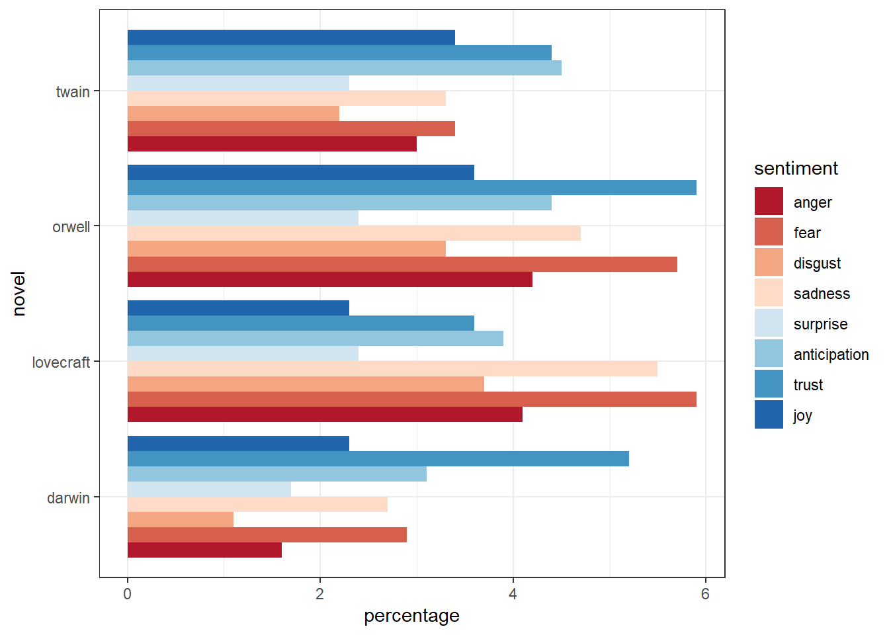

[Counting words](#counting-words) &emsp;&emsp;
[More complex methods - Classification](#classification) &emsp;&emsp;
[More complex methods - Others](#others) &emsp;&emsp;
[Visualisation](#visualisation)

### Introduction

Throughout this page, we have given links to further information in Wikipedia and in the tutorials provided by the Language Technology and Data Analysis Laboratory [LADAL](https://slcladal.github.io/) at the University of Queensland. We also have given references to published research using the methods we discuss.

LADAL has an overview of [text analysis and distant reading](https://slcladal.github.io/textanalysis.html).

### Counting Words {#counting-words}

#### Word frequency

Knowing how frequently words occur in a text can already give us information about that text and frequency lists based on large corpora are a useful tool in themselves - you can [download](https://kilgarriff.co.uk/bnc-readme.html) such lists for the (original) [British National Corpus](http://www.natcorp.ox.ac.uk/).

Tracking changes in the frequency of use of words across time has become popular since Google’s [n-gram viewer](https://books.google.com/ngrams) has been available. However, results from this tool have to treated with caution for reasons set out in this [blog-post](https://broadstreet.blog/2021/08/11/bad-ngrams/).

Comparing patterns of word frequency across texts can be part of authorship attribution. Patrick Juola [describes using this method](https://languagelog.ldc.upenn.edu/nll/?p=5315) when he tried to decide whether Robert Galbraith was really J.K Rowling.

This paper uses frequency and concordance analysis, with Australian data:


Bednarek, Monika. 2020. Invisible or high-risk: Computer-assisted discourse analysis of references to Aboriginal and Torres Strait Islander people(s) and issues in a newspaper corpus about diabetes. <i>PLoS ONE</i> 15/6: e0234486. <a href="https://doi.org/10.1371/journal.pone.0234486" target="_blank">https://doi.org/10.1371/journal.pone.0234486</a> 
>

The ratio of types and tokens in a text has been used as a measure of lexical diversity in developmental and clinical studies as well as in stylistics. It has also been applied to theoretical problems in linguistics:


Kettunen, Kimmo. 2014. Can Type-Token Ratio be Used to Show Morphological Complexity of Languages? <i>Journal of Quantitative Linguistics</i> 21(3). 223–245. <a href="https://doi.org/10.1080/09296174.2014.911506" target="_blank">https://doi.org/10.1080/09296174.2014.911506</a>.


#### Concordance

A concordance allows the researcher to see all instances of a word or phrase in a text, neatly aligned in a column and with preceding and following context (see image below).
Concordances are often a first step in analysis. The concordance allows a researcher to see how a word is used and in what contexts. Most concordancing tools allow sorting of results by either preceding or following words – the coloured text in the example below shows that in this case the results have been sorted hierarchically on the three following words. This possibility can help in discovering patterns of co-occurrence. Concordances are also very useful when looking for good examples to illustrate a point. (The type of display seen in the example is often referred to as KeyWord In Context – KWIC. There is a possibility of confusion here, as there is a separate analytic method commonly referred to as [Keywords](#keywords).)

<!--  -->



<h4>Example of a concordance</h4>
(The example here was produced by <a href="https://www.laurenceanthony.net/software/antconc/" target="_blank">Antconc</a>)

 


<!-- (The example here was produced by [Antconc](https://www.laurenceanthony.net/software/antconc/)) -->

This [tutorial](https://slcladal.github.io/kwics.html) from LADAL on concordancing uses a notebook containing R code as a method of extracting concordance data.

#### Clusters and collocations

Two methods can be used for counting the co-occurrence of items in text.
Clusters (sometimes known as n-grams) are sequences of adjacent items. A bigram is a sequence of two items, a trigram (3-gram) is a sequence of three items and so on. n-grams are types made up of more than one item, and therefore we can count the number of tokens of each n-gram in texts. n-grams are also the basis for a class of language models. (Google created a very large data set of English n-grams in developing their language-based algorithms and this [data is available](https://storage.googleapis.com/books/ngrams/books/datasetsv3.html).)
Collocations are patterns of co-occurrence in which the items are not necessarily adjacent. An example of why this is important is verbs and their objects in English. The object of a verb is a noun phrase and in many cases the first item in an English noun phrase is a determiner. This means that for many transitive verbs, the bigram _verb the_ will occur quite frequently. But it is much more interesting to know whether there are patterns relating verbs and the entities which are their objects.
Collocation analysis uncovers such patterns by looking at co-occurrences within a window of a certain size, for example three tokens on either side of the target. Collocation analysis gives information about the frequency of the co-occurrence of words and also a statistical measure of how likely that frequency is, given the overall frequencies of the terms in the corpus. Measures commonly applied include [Mutual Information](https://en.wikipedia.org/wiki/Mutual_information) scores and [Log-Likelihood](https://en.wikipedia.org/wiki/Likelihood_function#Log-likelihood) scores.
Collocations can also tell us about the meanings of words. If a word has collocates which fall into semantically distinct groups, this can indicate ambiguity or polysemy. And if different words share patterns of collocation, this can be evidence that the words are at least partial synonyms.

This graphic shows collocation relations in Darwin’s Origin of Species visualised as a network - the likelihood of a pair of words occurring in close proximity in the text is indicated by the weight of the line linking them:

<!--  -->



<h4>Collocation patterns in <i>Origin of Species</i> as a network</h4>

 

This article uses bigram frequencies as part of an analysis of language change:



Schweinberger, Martin. 2021. Ongoing change in the Australian English amplifier system. <i>Australian Journal of Linguistics</i> 41(2). 166–194. <a href="https://doi.org/10.1080/07268602.2021.1931028" target="_blank">https://doi.org/10.1080/07268602.2021.1931028</a>.

An article which uses concordances and collocation analysis:

Baker, Paul & Tony McEnery. 2005. A corpus-based approach to discourses of refugees and asylum seekers in UN and newspaper texts. <i>Journal of Language and Politics</i> 4(2). 197–226.


This research uses the discovery of shared patterns of collocation as evidence that the words are at least partial synonyms:


McEnery, Tony & Helen Baker. 2017. <i>Corpus linguistics and 17th-century prostitution: computational linguistics and history</i> (Corpus and Discourse. Research in Corpus and Discourse). London; New York, NY: Bloomsbury Academic. (especially chapters 4 and 5)


This [tutorial](https://slcladal.github.io/coll.html) from LADAL on analysing co-occurences and collocations uses a notebook containing R code as a method to extract and visualise semantic links between words.

#### Keywords

Keyword analysis is a statistically robust method of comparing frequencies of words in corpora. It tells us which words are more frequent (or less frequent) than would be expected in one text compared to another text and gives an estimate of the probability of the result. Keyword analysis uses two corpora: a **target** corpus, which is the material of interest, and a **comparison** corpus. Frequency lists are made for each corpus and then frequency of individual types in each corpus are compared. Keywords are ones which occur more ( or less) frequently in the target corpus than expected given the reference corpus.
The **keyness** of individual items is a quantitative measure of how unexpected the frequency is; chi-square is a one possible measure of this, but a log-likelihood measure is more commonly used. Positive keywords are words which occur more commonly than expected; negative keywords are words which occur less commonly than expected.

This visualisation shows a comparison of positive distinguishing words for three texts (Charles Darwin’s _Origin_, Herman Melville’s _Moby Dick_, and George Orwell’s _1984_), words that occur more commonly than we expect in one text when taking the other two texts as a comparison:

<!--  -->



<h4>Keywords from three texts</h4>

 


This paper applies keyword analysis to Australian text data sourced from a television series script:


Bednarek, Monika. 2020. Keyword analysis and the indexing of Aboriginal and Torres Strait Islander identity: A corpus linguistic analysis of the Australian Indigenous TV drama Redfern Now. <i>International Journal of Corpus Linguistics</i> 25/4: 369-99. <a href="http://doi.org/10.1075/ijcl.00031.bed" target="_blank">http://doi.org/10.1075/ijcl.00031.bed</a>


Tony McEnery describes using the keyword analysis method to compare four varieties of English in this chapter:


McEnery, Tony. 2016. Keywords. In Paul Baker & Jesse Egbert (eds.), *Triangulating methodological approaches in corpus-linguistic research* (Routledge Advances in Corpus Linguistics 17), 20–32. New York: Routledge.


This article explores how to assess Shakespeare’s use of words to build characters by using keyword analysis of the characters' dialog:


Culpeper, Jonathan. 2002. Computers, language and characterisation: An analysis of six characters in Romeo and Juliet. In <i>Conversation in Life and in Literature: Papers from the ASLA Symposium</i> (Association Suedoise de Linguistique Appliquee (ASLA) 15), 11–30. Uppsala: Universitetstryckeriet. (<a href="https://lexically.net/wordsmith/corpus_linguistics_links/Keywords-Culpeper.pdf" target="_blank">pdf</a>)


### More complex methods – Classification {#classification}

Classification methods aim to assign some unit of analysis, such as a word or a document, to a class. For example, a document (or a portion of a document) can be classified as having positive or negative sentiment. These methods are all examples of supervised machine learning. An algorithm is trained on the basis of annotated data to identify classifiers in the data – features which correlate in some way with the annotated classifications. If the algorithm achieves good results on testing data (classified by human judgment), then it can be used to classify unannotated data.

#### Document Classification

The task here is to assign documents to categories automatically. An everyday example of this procedure is spam filtering of email that may be applied by internet service providers and also within email applications. An example of this technique being used in research would be automatically identifying historical court records as referring either to violent crimes, property offences, or other crimes.

The following two articles taken together give an account of a technique for partially automating the training phase of classification and then of how the classifiers allowed researchers to access new information in a large and complex text.


Leavy, Susan, Mark T Keane & Emilie Pine. 2019. Patterns in language: Text analysis of government reports on the Irish industrial school system with word embedding. <i>Digital Scholarship in the Humanities</i> 34(Supplement_1). i110–i122. <a href="https://doi.org/10.1093/llc/fqz012" target="_blank">https://doi.org/10.1093/llc/fqz012</a>.
 
Pine, Emilie, Susan Leavy & Mark T. Keane. 2017. Re-reading the Ryan Report: Witnessing via Close and Distant Reading. <i>Éire-Ireland</i> 52(1–2). 198–215. https://doi.org/10.1353/eir.2017.0009. (<a href="https://researchrepository.ucd.ie/handle/10197/10287" target="_blank">available online</a>)


[Wikipedia](https://en.wikipedia.org/wiki/Document_classification)

#### Sentiment analysis

Sentiment analysis assigns documents according to the affect which they express. In simple cases, this can mean sorting documents into those which a express a positive view and those which express a negative view (with a neutral position sometimes also included). Such classifications are the basis for aggregated ratings - for example, online listings of movies and restaurants. A sentiment value is assigned to individual reviews then an aggregate score is calculated based on those values and that aggregate score is the rating presented to the user. More sophisticated sentiment analysis can assign values on a scale. Some sentiment analysis tools use dictionaries of terms with sentiment values assigned to those terms; these are known as pre-trained or pre-determined classifiers.

The following figure shows the results of the sentiment analysis of four texts (_The Adventures of Huckleberry Finn_ by Mark Twain, _1984_ by George Orwell, _The Colour out of Space_ by H.P.Lovecraft, and _On the Origin of Species_ by Charles Darwin) using the Word-Emotion Association Lexicon (Mohammad and Turney 2013). The graphic shows what percentage of each text can be assigned to each of eight categories of sentiment:

<!--  -->



<h4>Sentiment analysis of four texts</h4>

 


The Wikipedia entry for [Sentiment Analysis](https://en.wikipedia.org/wiki/Sentiment_analysis) gives more information and examples particularly in relation to the use of sentiment analysis as a tool used in online settings.

LADAL’s [Sentiment Analysis tutorial](https://slcladal.github.io/sentiment.html) uses a notebook containing R code as a method of performing sentiment analysis.

This article discusses problems in assembling training data for complex sentiment analysis tasks and then applies the results to oral history interviews with Holocaust survivors:


Blanke, Tobias, Michael Bryant & Mark Hedges. 2020. Understanding memories of the Holocaust—A new approach to neural networks in the digital humanities. <i>Digital Scholarship in the Humanities</i> 35(1). 17–33. <a href="https://doi.org/10.1093/llc/fqy082" target="_blank">https://doi.org/10.1093/llc/fqy082</a>.


#### Named Entity Recognition

Named Entity Recognition involves two levels of classification. First, segments of text are classified as either denoting or not denoting an entity: for example, a person, a place or an organization. The identified entities can then be classified as belonging to one of the types of entity.

The Wikipedia entry explaining [named-entity recognition](https://en.wikipedia.org/wiki/Named-entity_recognition) gives further detail about the technique.

This article looks at the problems encountered when applying a well-known entity recognition package ([Stanford](https://nlp.stanford.edu/software/CRF-NER.html)) to historical newspapers in the National Library of Australia’s Trove collection:


Mac Kim, Sunghwan & Steve Cassidy. 2015. Finding names in Trove: Named Entity Recognition for Australian historical newspapers. In <i>Proceedings of the Australasian Language Technology Association Workshop 2015</i>, 57–65. (<a href="https://aclanthology.org/U15-1007.pdf" target="_blank">pdf</a>)


This article (section 6.3) discusses why entity recognition is not as useful as might be expected when studying names in novels:


Dalen-Oskam, K. van. 2013. Names in novels: An experiment in computational stylistics. <i>Literary and Linguistic Computing</i> 28(2). 359–370. <a href="https://doi.org/10.1093/llc/fqs007" target="_blank">https://doi.org/10.1093/llc/fqs007</a>.


#### Computational Stylistics (Stylometry)

This method is also referred to as authorship attribution as the classification task is to assess patterns of language use in order to decide whether to attribute a piece of text to a particular author (and with what degree of confidence). Seemingly simple classifiers are used for this task as they are assumed to be less open to conscious manipulation by writers. For example, comparative patterns of occurrence of function words such as _the_ and _a/an_ are considered a better classifier than occurrences of content words. Character n-grams, that is sequences of characters of a specified length, have also proven to be a good classifier for use in this task. A recent example of these techniques being applied in a case which received a good deal of public attention was the controversy about whether [Robert Galbraith was really J.K Rowling](https://languagelog.ldc.upenn.edu/nll/?p=5315).

The Wikipedia entry on [stylometry](https://en.wikipedia.org/wiki/Stylometry) gives further information on the methodology.

This article applies stylometric techniques to a classic of Chinese literature:


Zhu, Haoran, Lei Lei & Hugh Craig. 2021. Prose, Verse and Authorship in Dream of the Red Chamber: A Stylometric Analysis. <i>Journal of Quantitative Linguistics</i> 28(4). 289–305. <a href="https://doi.org/10.1080/09296174.2020.1724677" target="_blank">https://doi.org/10.1080/09296174.2020.1724677</a>.



An overview of the use of function words in stylometry:


Garcia, A. M. & J. C. Martin. 2007. Function Words in Authorship Attribution Studies. <i>Literary and Linguistic Computing</i> 22(1). 49–66. <a href="https://doi.org/10.1093/llc/fql048" target="_blank">https://doi.org/10.1093/llc/fql048</a>.


A classic stylometric study using Bayesian statistics rather than machine learning is:


Mosteller, Frederick & David Lee Wallace. 1984. <i>Applied Bayesian and classical inference: the case of the Federalist papers</i>. New York: Springer-Verlag.


### More complex methods – Others {#others}

#### Topic models

Topic modeling is a method which tries to recover abstract ‘topics’ which occur in a collection of documents. The underlying assumption is that different topics will tend to be associated with different words, different documents will tend to be associated with different topics, and therefore the distribution of words across documents allows us to find topics. The complete model includes the strength of association (or probability) between each word and each topic, and between each topic and each document. A topic consists of a group of words and it is up to the researcher to decide if a semantically coherent interpretation can be given to any of the topics recovered. The number of topics to be recovered is specified in advance.

The example visualisation below is based on topic modeling of the State of the Union addresses given by US presidents, and shows the relative importance of different topics over time. In the right hand part of the figure, the words most closely linked to each topic are listed; the researcher has not attempted to give labels to these (although in some cases, it is not too hard to imagine what labels we might use). Note also that words are not uniquely linked to topics - for example, the word _state_ is closely linked to seven of the topics in this model.

<!--  -->



<h4>Topics in the State of the Union Address over time</h4>

 


The Wikipedia entry for [topic models](https://en.wikipedia.org/wiki/Topic_model) gives a more detailed explanation of the process.

This [topic modeling tutorial](https://slcladal.github.io/topicmodels.html) from LADAL uses R coding to process textual data and generate a topic model from that data.

<i>Poetics</i> 41(6) is a journal issue devoted to the use of topic models in literary studies: the introduction to the journal (by Mohr and Bogdanov: <a href="https://doi.org/10.1016/j.poetic.2013.10.001" target="_blank">https://doi.org/10.1016/j.poetic.2013.10.001</a>) provides a useful overview of the method.

And this paper uses topic modeling as one tool in trying to improve access to a huge collection of scholarly literature:


Mimno, David. 2012. Computational historiography: Data mining in a century of classics journals. <i>Journal on Computing and Cultural Heritage</i> 5(1). 1–19. <a href="https://doi.org/10.1145/2160165.2160168" target="_blank">https://doi.org/10.1145/2160165.2160168</a>.


#### Network Analysis

Network analysis allows us to produce visualisations of the relationships between entities within a dataset. Analysis of social networks is a classic application of the method, but words and documents can also be thought of as entities and the relationships between them can then be analysed with this method. (see example visualisation of Darwin’s _Origin of Species_ above)
Here is another example of a network graph illustrating the relationships between the characters of Shakespeare’s _Romeo and Juliet_:

<!--  -->



<h4>Network of characters in <i>Romeo and Juliet</i></h4>

 


This article gives several examples of how representing collocational links between words as a network can lead to insight into meaning relations:


Brezina, Vaclav, Tony McEnery & Stephen Wattam. 2015. Collocations in context: A new perspective on collocation networks. <i>International Journal of Corpus Linguistics</i> 20(2). 139–173. <a href="https://doi.org/10.1075/ijcl.20.2.01bre" target="_blank">https://doi.org/10.1075/ijcl.20.2.01bre</a>. (pdf)


Wikipedia has articles on network theory in [general](https://en.wikipedia.org/wiki/Network_theory) and on [social network analysis](https://en.wikipedia.org/wiki/Social_network_analysis).
in particular.

LADAL’s tutorial on [Network Analysis](https://slcladal.github.io/net.html) introduces this method using R coding.

### Visualisation {#visualisation}

Visualisation is an important technique for exploring data, allowing us to see patterns easily, and also for presenting results.
There are many methods for creating visualisations and this article gives an overview of some possibilities for visualising corpus data:


Siirtola, Harri, Terttu Nevalainen, Tanja Säily & Kari-Jouko Räihä. 2011. Visualisation of text corpora: A case study of the PCEEC. <i>How to Deal with Data: Problems and Approaches to the Investigation of the English Language over Time and Space</i>. Helsinki: VARIENG 7. <a href="https://varieng.helsinki.fi/series/volumes/07/siirtola_et_al/index.html" target="_blank">[html]</a>


If you would like to see something more complex, this article includes animations showing change in use of semantic space over time – but you need to have full access to the online publication to see it.


Hilpert, Martin & Florent Perek. 2015. Meaning change in a petri dish: constructions, semantic vector spaces, and motion charts. <i>Linguistics Vanguard</i> 1(1). <a href="https://doi.org/10.1515/lingvan-2015-0013" target="_blank">https://doi.org/10.1515/lingvan-2015-0013</a>.


This LADAL tutorial on [data visualisation](https://slcladal.github.io/introviz.html) in R makes use of the [ggplot2](https://ggplot2.tidyverse.org/) package to create some common data visualisations using code.

[Overview](../overview) &emsp;&emsp; [Data Preparation](../data-prep/) &emsp;&emsp; [Research Objects](../research-objects)
